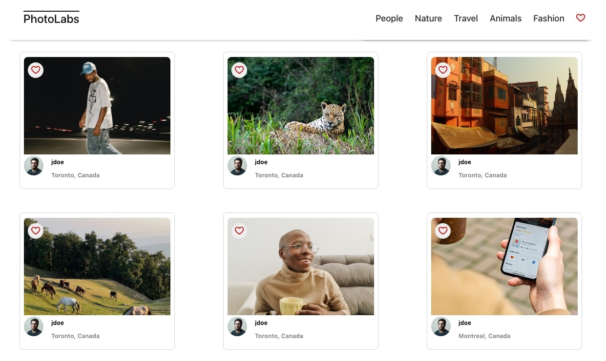
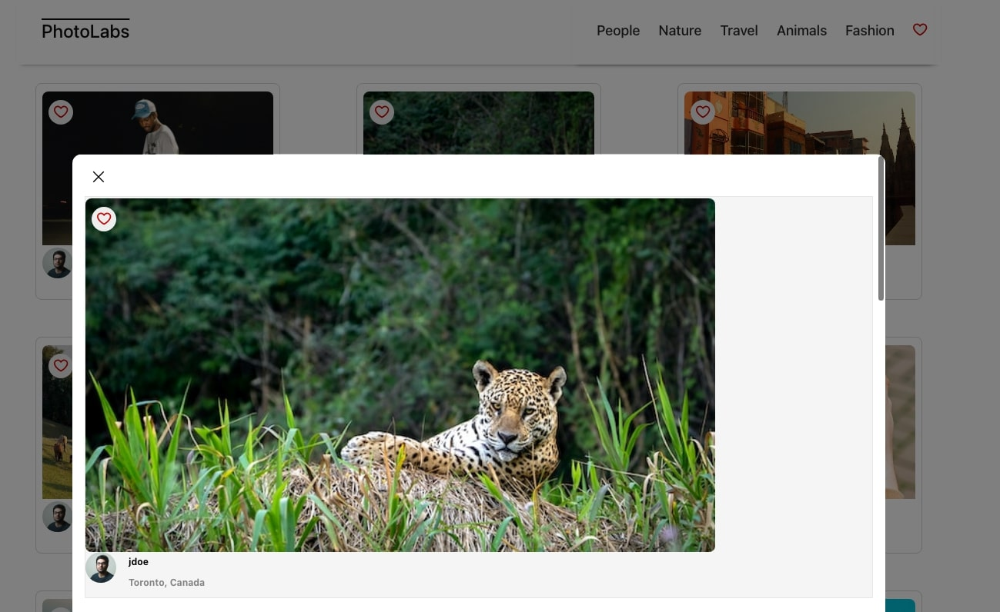
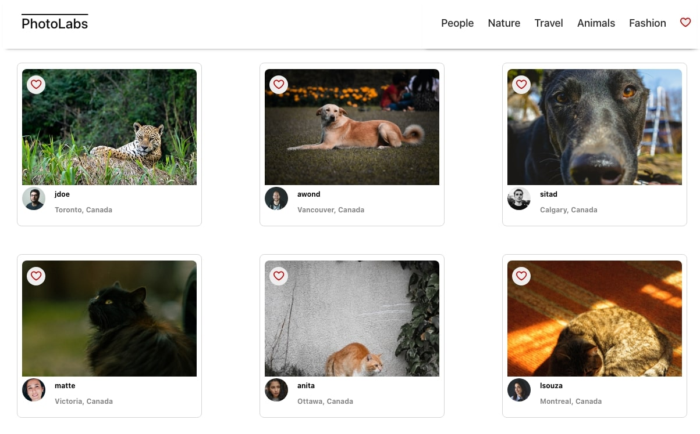
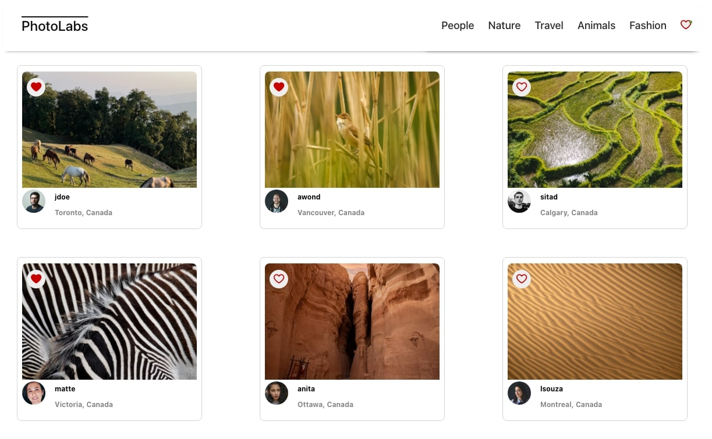

# React - Photolabs
Matt Yu's completed PhotoLabs project as part of the React module. 

# Photolabs
Photolabs is the perfect application for folks looking to show off their photography skills and display their work. PhotoLabs allows users to explore a variety of different photos, having the ability to scroll and sort through different topic categories as well. Photolabs also provides users with the ability to heart any photos that they like. When they do, the heart outline will fill red. 

#### Photolabs Homepage


When users log into Photolabs, they are presented with a homepage full of intriguing and interesting photos. The photographer's name along with their location and country can also be found below each image.

#### Photolabs Modal

For users that want a closer look at an image, they are able to click on it, where an expanded view of the image will be populated in the modal pop-up window.

If users scroll below the enlarged modal view, a variety of similar photos can be found. 

#### Topics

Users also have the ability to filter and toggle through various photo topics. 

#### Liked Photos

Users also have the ability to like photos. Users can do this in both the modal view, and while on the home page. Users can also like the similar photos that appear in the modal view. 

## Setup

Install dependencies with `npm install` in each respective `/frontend` and `/backend` folder.

## Depenencies
1. React: ^18.2.0
2. React-dom: ^18.2.0
3. React-scripts: ^5.0.1
4. @testing-library/jest-dom: ^5.16.5
5. @testing-library/react: ^13.4.0
6. @testing-library/user-event: ^13.5.0
7. Web-vitals: ^2.1.4
8. Body-parser: ^1.18.3
9. Cors: ^2.8.5
10. Dotenv: ^7.0.0
11. Express: ^4.16.4
12. Helmet: ^3.18.0
13. pg: ^8.5.0
14. Socket.io: ^2.2.0
15. ws: ^7.0.0


## [Frontend] Running Webpack Development Server

```sh
cd frontend
npm start
```
Please ensure that the backend database and server are running before running `npm start` in the frontend repository.  

## [Backend] Running Backend Servier

Read `backend/readme` for further setup details. 

```sh
cd backend
npm start
```